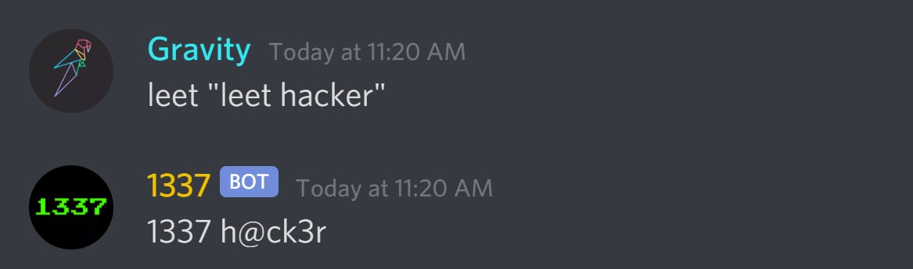

# 1337-bot
🤖 A Discord bot to translate English to Leetspeak.

## 🤖 What does it do?
Wanna be a `1337 h@ck3r`? Just type `leet "leet hacker"`.



## 🚀 Local Development
Create a file called `token` and put your token in it.
```python
alphabet = "abcdefghijklmnopqrstuvwxyz "
leetspeak  = "<LEETSPEAK>"

bot = commands.Bot(command_prefix='<PREFIX>')
```

## 👨‍💻 Contact

Linkedin: [Raadwan Masum](https://www.linkedin.com/in/raadwan-masum-9147bb1a5)
<br>
Github: [raad1masum](https://github.com/raad1masum)
<br>
Devpost: [Raadwan masum](https://devpost.com/raad1masum)
